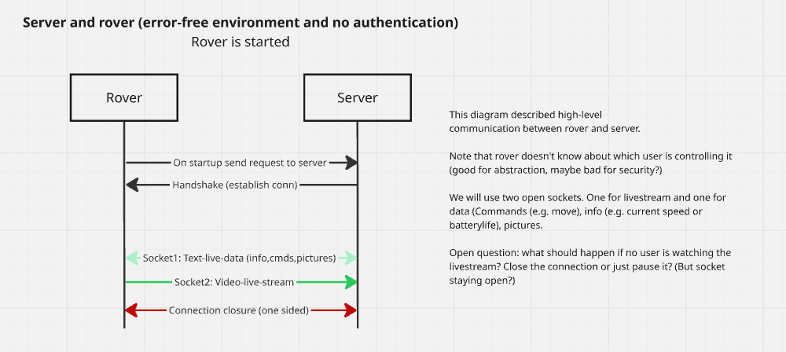
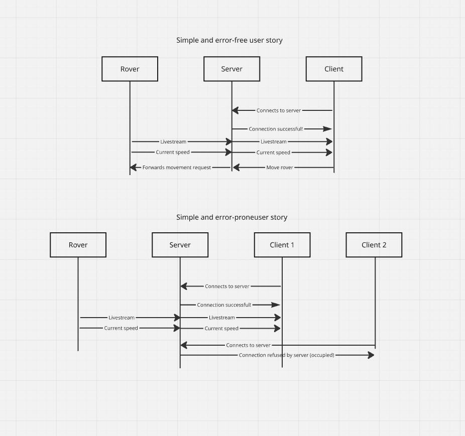

# High-level requirements for infrastructure

## Server and rover

- Rover talks only to server (but can be redirected by server to client and perform P2P)
- Low delay
- Server asks Rover to take photo, which is then sent back
- Communicate via HTTP
- Try to move CPU intensive tasks to server (maybe saves battery?)
- Security: how to make sure rover only accepts data from server?

## Server and client/app

- Create authentication and authorization infrastructure
- Request and connect to the rover for remote access
- Watch only the livestream? (Maybe as a control panel person)
- Send live data (e.g. commands)

## State diagram

The following diagrams are just for understanding the process. They assume we are using different socket for LiveStream and data.

### Diagram: Rover establishes connection

### Diagram: High level overview

